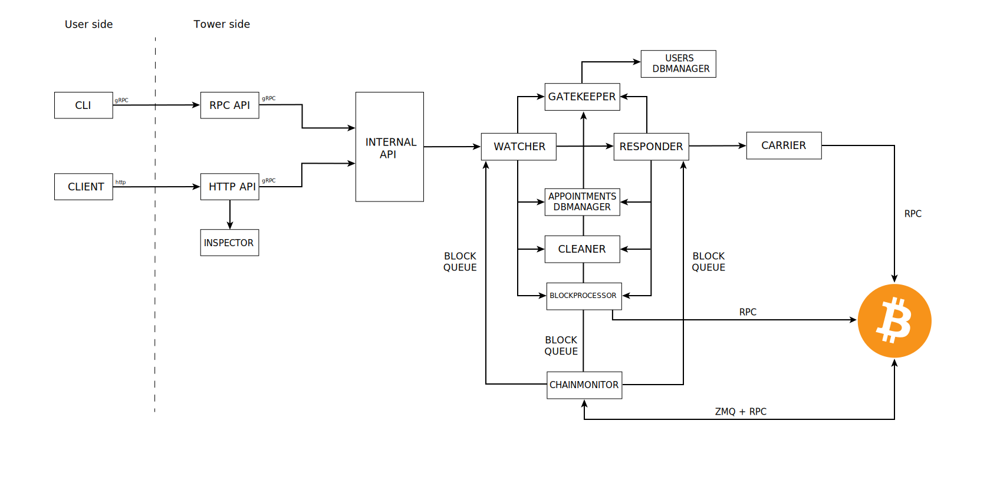

At a high level, the tower architecture boils down to a client/server paradigm where the client sends / requests data from / to the tower, and the tower serves and offers services on the provided data.

The user side can be split in two. On the one hand, the command line interface (`teos-cli`) used by the tower administrator to both manage the tower and monitor its state. On the other hand, the client, who acts as the actual user. The client can be any lightning node that implements BOLT13. A couple examples are provided within the repository (`teos-client` and `watchtower-plugin`).

The `RPC API` sits between the `cli` and the tower internals and deals with the admin authentication. The `HTTP API`, oppositely, sits between the user and the tower and is in charge of both managing user authentication and data sanity checks. The API uses the `Inspector` for the latter.

The `cli` interacts with the tower using `gRPC` and the client, **currently**, interacts with the tower using `http(s)`. Both of them connect to the `InternalAPI` using `gRPC`, which is the only access point to the tower internals. Finally, the `InternalAPI` connects directly with the `Watcher`.

The `Watcher` is one of the main actors in the tower. It is in charge of watching for channels breaches in the transactions included in every newly generated block (that extends the best chain). The `Watcher` receives block data from the `ChainMonitor` using a queue, and checks the received data against the `appointments` sent by the users. In order to process the received block data, the `Watcher` queries the `BlockProcessor`, that interfaces directly with `bitcoind` using its `RPC` interface.

When receiving a new appointment, the `Watcher` only keeps a summary of appointment data (the minimum required to detect breaches) and stores the rest in the **appointments database**, using the `AppointmentsDBM` for the purpose. Furthermore, it is worth mentioning that the `Watcher` is completely agnostic of the users in the system. When a new appointment is handed to the `Watcher` alongside the user data, it does hand it straight to the `Gatekeeper`, who is in charge of guarding the access to the tower and managing user subscriptions. Only if the `Gatekeeper` finds the request valid does the `Watcher` start watching for the given appointment.

The `Gatekeeper` is in charge of both authenticating users and keep track of subscription expiration. To do the latter, it receives data from the `ChainMonitor` using a block queue. Similarly to the `Watcher`, the `Gatekeeper` does back up the users information into a database (the **users database**), using the `UsersDBM` for the purpose.

Every time the `Watcher` processes a new block two tasks may be triggered. First, if a trigger is found (meaning a channel has been potentially breached) the data is passed to the `Responder` and the `Watcher`'s job is considered done. Secondly, garbage collection services are triggered, so data that has been completed (passed to the `Responder`) or outdated (reached the EOL without a trigger) are deleted both from memory and the database. This also includes the user data kept by the `Gatekeeper`. The data deletion process is managed by the `Cleaner`.

When an appointment is passed to the `Responder` it uses the trigger data to try to broadcast the penalty transaction to the Bitcoin network. In case the transaction is valid, the `appointment` is transformed into a `tracker`, and the `Responder` keeps track of it until it gets confirmed, eventually rebroadcasting or bumping the transaction fee if necessary1. The `Responder` is also in charge of keeping an eye for chain reorganisation and act accordingly (e.g. rebroadcasting the breach or penalty transactions, or even handing the data back to the `Watcher` is the reorg is deep enough2).

The `Responder` is not directly connected to `bitcoind`. Instead, it uses the `Carrier`, who connects to the `RPC` interface and hands back a receipt stating whether the transaction was successfully delivered or not. To keep track of the confirmations that a given tracker has, the `Responder` receives data from the `ChainMonitor` using a block queue, and processes it using the `BlockProcessor`.
Once a transaction has been irrevocably resolved (100 confirmations according to [BOLT5](https://github.com/lightningnetwork/lightning-rfc/blob/b201efe0546120c14bf154ce5f4e18da7243fe7a/05-onchain.md#general-nomenclature)) data deletion is also be triggered, which is, again, handled by the `Cleaner`.

Finally, the `ChainMonitor` is the main interface between the tower and `bitcoind`. It acts both as a data provider and a state transition trigger, given time in the tower is measured in blocks. The `ChainMonitor` interfaces with `bitcoind` using both the `ZMQ` and the `RPC` interfaces. From the former, it receives new blocks notifications, but it also polls the latter for new block tips in fixed internals in case any notification is missed. Once a new block is received, the `ChainMonitor` populates the block queues of the subscribers (the `Watcher`, the `Responder` and the `Gatekeeper`) so they can act on them.

1Fee bumping is not yet implemented.

2Currently there's no way back from the `Responder` to the `Watcher`, since full reorg management is not implemented.